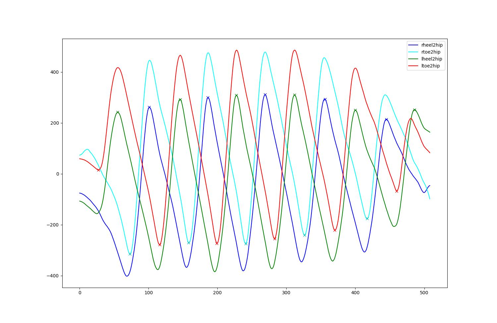
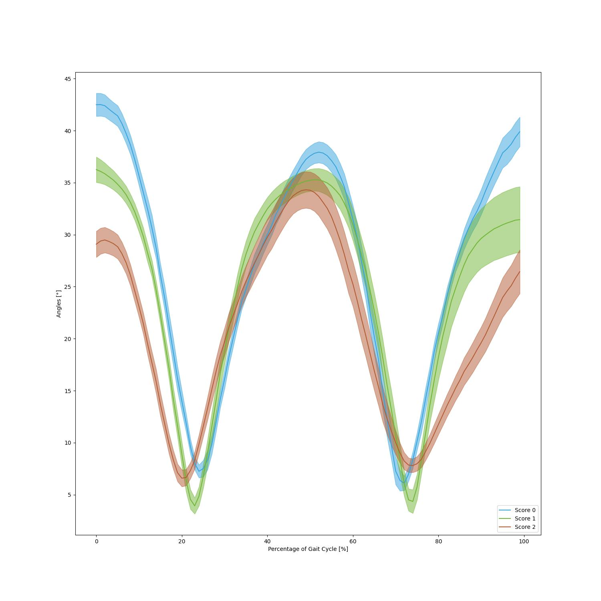

# TULIP

This repository holds the demo data, gait feature extraction and visualization code for the paper:

[**TULIP: Multi-camera 3D Precision Assessment of Parkinson’s Disease**](https://openaccess.thecvf.com/content/CVPR2024/papers/Kim_TULIP_Multi-camera_3D_Precision_Assessment_of_Parkinsons_Disease_CVPR_2024_paper.pdf) Kyungdo Kim, Sihan Lyu, Sneha Mantri and Timothy W. Dunn, CVPR 2024. 

For more information, please visit out TULIP project website. [link](https://www.tulipproject.net/)

## Demo data - "ThreeSubjects_GaitPoses.pkl"
We provide three subjects' gait poses data saved in the file "ThreeSubjects_GaitPoses.pkl". Subject 7, 8 and 13 gait behaviors were respectively labeled as score 0, 1 and 2 by experienced clinicians, based on UDPRS criteria. The pose data for each subject is saved as a NumPy array with a shape of (4801, 26, 3), where 4801 represents the number of frames, 26 indicates the number of key points, and 3 denotes the three dimensions. The pose format is based on Halpe26. You can visit their Github [page](https://github.com/Fang-Haoshu/Halpe-FullBody) for detailed information.

## Gait feature extraction - "extract_features.py"
We provide the code for extracting gait features and it can generate plots to visualize detected gait events - heel-strike and toe-off. The cross sign represents the detected gait events. All plots are in the "validation_figures" folder.
<div align="center">
    
</div>

## Gait angle visualization - "plot_angles.py"
We provide the code for visualizing specific angles during the gait cycle. Here we show an example to visualize angles between two legs during the whole gait cycle.
<div align="center">
    
</div>

## Citation
Please cite the following paper if you use this repository in your research.
```
@InProceedings{Kim_2024_CVPR,
    author    = {Kim, Kyungdo and Lyu, Sihan and Mantri, Sneha and Dunn, Timothy W.},
    title     = {TULIP: Multi-camera 3D Precision Assessment of Parkinson's Disease},
    booktitle = {Proceedings of the IEEE/CVF Conference on Computer Vision and Pattern Recognition (CVPR)},
    month     = {June},
    year      = {2024},
    pages     = {22551-22562}
}
```
